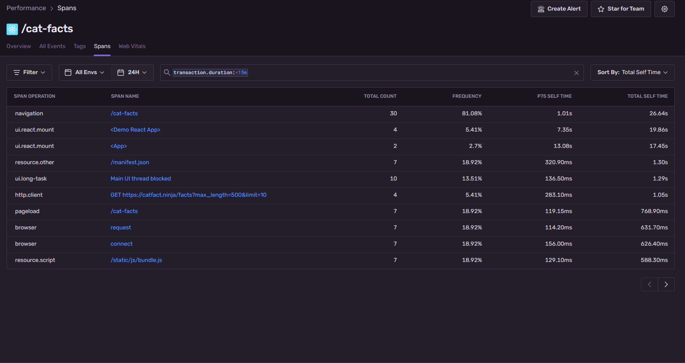
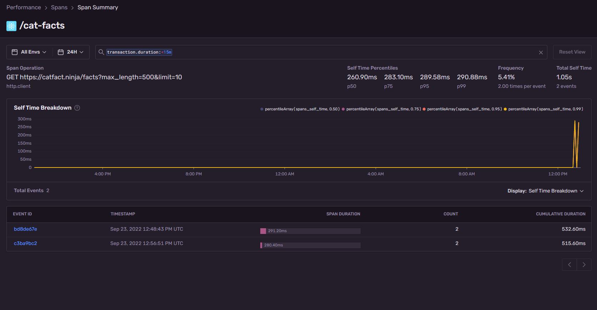

# Project Set up

Install dependencies:

### `npm install`

Start the development server

### `npm start`

Runs the app in the development mode.\
Open [http://localhost:3000](http://localhost:3000) to view it in your browser.

# Sentry Integration
### Sentry account set up to Monitor the web application

- Create your own Sentry dev account, org, and project by signing up here:
  https://sentry.io/signup/
- Create a new React project under Project > Create Project
- Copy Client keys from SDK setup section under the project settings
- Under src/index.js Replace the DSN with your DSN you just copied

### This POC demonstrates a React web app with 3 Routes

- /Home - Simple HTML page
- /cat-facts - Page using fetch to retrieve a remote resource
- /button - An inaccessible page rendering a React component with an undeclared function

### Sentry instrumentation

Under the project, visit Performance > Spans to view span summary

1. Instruments spans for various operation

2. Navigation transactions

3. React Component Profiler
 
4. Capture Fetch request

5. Capture Error events on the button page to identify the issue

